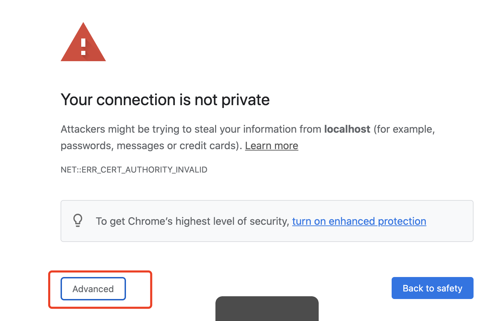
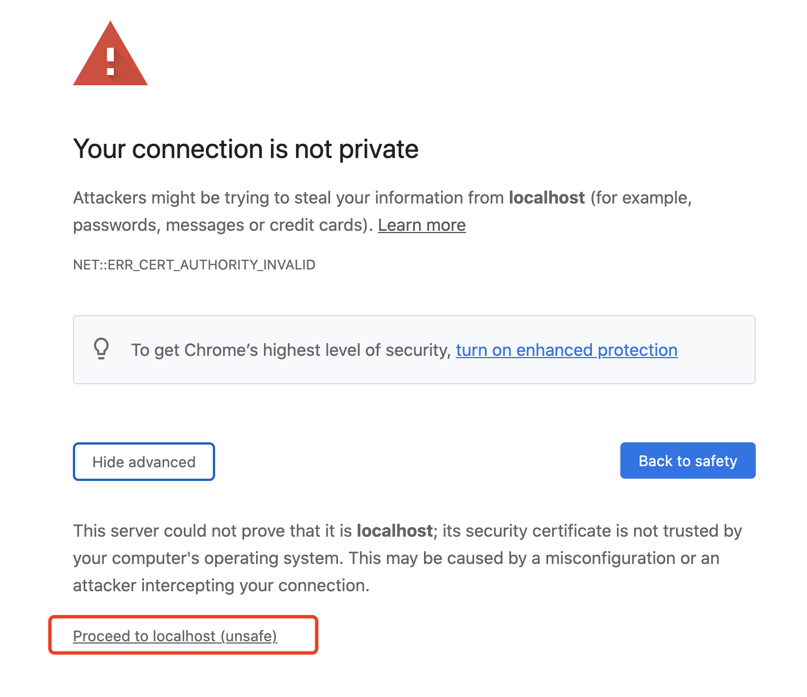
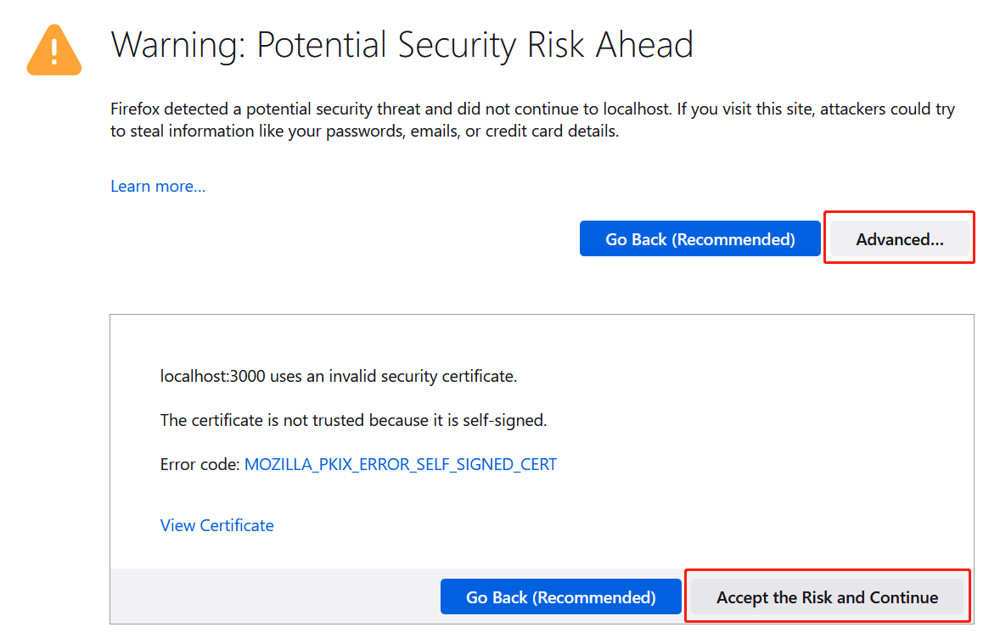

# Collaborative_content_coding
[](https://lerna.js.org/)  
Backend Status: [](https://travis-ci.org/zyan225/Collaborative_content_coding)

- **Project Number:** 76
- **Teammates:** 
  - Yujia Wu
  - Emily Yang
- **Supervisor:** Dr. Kelly Belincoe

# BEFORE RUN

## Installatoin
You must have the following installed
- Python Version: 3.9
- pip Version: 21
- npm Version: 14

# Setup instructions for Markers 
Application is ready to run as all keys, firebase config and env files are included in the source code
## backend
```
  cd backend  // move into backend directory
  pip install -r requirements.txt // install dependencies
  python main.py  // run
```

## frontend
### Mac OS
***You must have Chrome installed to run this website locally***

```
cd app  // move into app directory
npm run start-mac   // run the project   
```
Once running, you will see the browser showing a invalid certificate warning.   


Click "Advanced" button.

Then click "Proceed to localhost (unsafe)" 

### Windows
***You must have Firefox installed to run this website locally***
```
cd app  // move into app directory
npm run start-windows   // run the project   
```
Open the frontend url in Firefox, and you will see the security warning as below:


Click "Advanced", then click "Accept the Risk and Continue".    

## Upload data
A sample csv file, "simple_csv_without_id.csv" is included under the root folder. This file can be used to test the upload functionality. 

# Setup instructions for Developers 
## 1. Set envrionment files
- Put the environment files (.env) within the /app and the /backend directories
- App environment file should contain the following "REACT_APP_API_URL='URL FOR BACKEND API'"
- Backend environment file should contain the following "ATLAS_URI='URL FOR MONGODB DATABASE'"
- Frontend should also have the firebase config in /app/components/Firebase/firebase.ts file 
- Backend should also have the file for firebase configurations
- Please contact zyan225@aucklanduni.ac.nz for the environment files required to run the project if you are having trouble

## 2. Generate key and certificate to run https locally
Follow the tutorial below:
https://flaviocopes.com/react-how-to-configure-https-localhost/   
Then follow the instructions for markers to install and run the application

# Project Requirements
Web based tool to label text documents, for machine learning tasks. Supervised machine learning with text requires manual labels to be assigned to many documents by human coders. This tool will facilitate human coders to privately (still online) assign predefined labels to a set of documents and then compare their labels with other coders to give an agreed label.

-  **Support Data privacy:** The tool has a database stored on the cloud, so you do not need to setup the database. Encryption is used to ensure the data is kept private from the tool maintainers.
- **Technologies:** Web based. Accessible from windows and MacOS
- **Lanuages:**
  - **Frontend:** HTML, CSS, Typescript, Ionic UI, Material ui
  - **Backend:** Python, Flask
  - **Database:** MongoDB

## General Features
- User accounts (sign in/out)
- Shared projects (datasets) between users
- Create predefined labels in the project
- Each user can assign a predfined label to each document
- Data import and export as .sqlite 
- Automatic label compare between users
- Calculate agreement score between users (http://dfreelon.org/utils/recalfront/recal2/)
- Facilitate label disagreement resolution. Including comments on documents
- Modify labels -> rename, parent/child associations 
- modified labels should be automatically propagated
- user edit access levels-> creating labels etc
- Update db often
